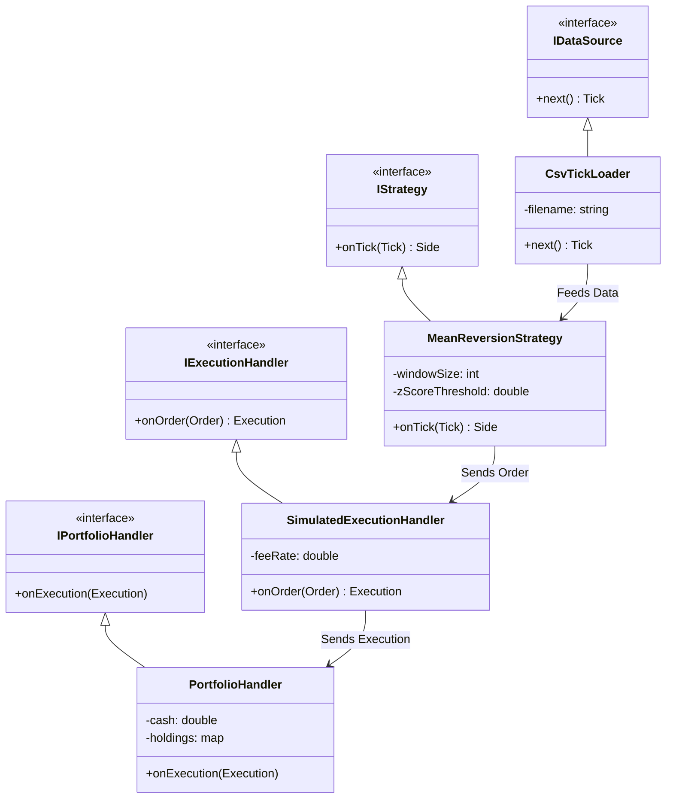

# High-Frequency Trading Strategy Backtester (C++)


A high-performance, modular backtesting engine designed for HFT strategies. This project simulates an event-driven trading environment to validate **Mean Reversion** algorithms using statistical data modeling.

---

## Key Features

* **Modular Architecture:** Strict separation of concerns (Data, Strategy, Execution, Portfolio) using Interface-based design (SOLID principles).
* **Performance:** Optimized with `-O3` and `-march=native` for low-latency execution simulation.
* **Statistical Modeling:** Uses **Ornstein-Uhlenbeck process** to generate realistic mean-reverting market data for strategy validation.
* **Quality Assurance:**
    * Unit Testing via **GoogleTest**.
    * CI/CD pipeline via **GitHub Actions**.
* **Containerization:** Fully Dockerized environment for reproducible builds.

---

## 🛠 Installation & Usage

### 1. Clone the Repository

Start by downloading the source code:

```bash
git clone [https://github.com/SAWSKA/cpp-strategy-backtester.git](https://github.com/SAWSKA/cpp-strategy-backtester.git)
cd cpp-strategy-backtester
```

## 🛠 Installation & Usage

### 1. Clone the Repository

Start by downloading the source code:

```bash
git clone [https://github.com/SAWSKA/cpp-strategy-backtester.git](https://github.com/SAWSKA/cpp-strategy-backtester.git)
cd cpp-strategy-backtester
```
2. Choose Your Workflow
You can run the backtester using Docker (easiest, no dependencies) or build it Locally.

Option A: Docker (Recommended)
This will build the image, generate data, and run the simulation inside a container.

make docker-all

Option B: Local Build
Prerequisites:
CMake 3.20+
C++ Compiler (GCC/Clang/MSVC) supporting C++20
Python 3 (for data generation)
Steps:

# 1. Generate Data
```bash
python3 scripts/generate_data.py
```
# 2. Configure & Build (Release Mode)
```bash
make build
```
# 3. Run Simulation
```bash
make run
```


---

## Architecture

The system is built on 4 core layers using an interface-based design pattern.



1. **Data Layer (`CsvTickLoader`):**
* High-speed CSV parsing.
* Converts raw ticks into normalized internal structures.


2. **Strategy Layer (`MeanReversionStrategy`):**
* Implements Bollinger Bands logic using incremental calculation of Mean and Variance (Welford's algorithm approach).
* Signal generation based on Z-score deviation.


3. **Execution Layer (`SimulatedExecutionHandler`):**
* Simulates exchange latency and liquidity.
* Calculates transaction costs (Maker/Taker fees).


4. **Portfolio Layer (`PortfolioHandler`):**
* Real-time PnL tracking (Mark-to-Market).
* Position management and risk checks.


---

## Math & Methodology

### Why Ornstein-Uhlenbeck?

Standard random walks (Brownian motion) are non-stationary, making them unsuitable for testing Mean Reversion strategies. I implemented the **Ornstein-Uhlenbeck process** to generate synthetic data with mean-reverting properties:

* : Rate of reversion (spring stiffness).
* : Long-term mean price.
* : Volatility.

**Result:** On Random Walk data, the strategy yielded a net loss (as expected). On OU-generated data, the strategy demonstrated a consistent profit (**+2.34%** ROI in simulation), validating the logic.

---

## Quick Start

### Prerequisites

* CMake 3.20+
* C++ Compiler (GCC/Clang/MSVC) supporting C++20
* Python 3 (for data generation)
* Docker (Optional)

### Local Build & Run

```bash
# 1. Generate Data
python3 scripts/generate_data.py

# 2. Configure & Build (Release Mode)
make build

# 3. Run Simulation
make run

```

### Docker Run (Recommended)

No local dependencies required.

```bash
make docker-all

```

---

## Results & Demo

Running the simulation on Ornstein-Uhlenbeck generated data demonstrates the strategy's ability to capitalize on mean reversion.


*Figure: Terminal output showing trade execution logs, fee calculation, and final PnL report.*

---

## Testing

The project uses GoogleTest for unit testing strategy logic and execution math.

```bash
make test

```


